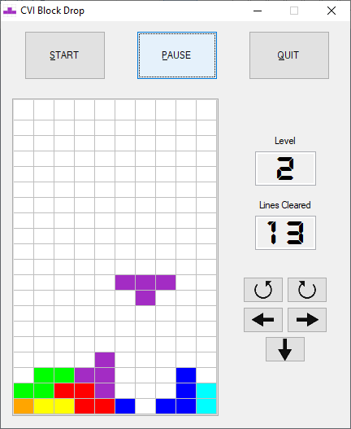

# CVI Blockdrop
A block drop puzzle game written for LabWindows/CVI.

## Introduction
This game uses a table control as the playing area. The background color of each cell is set to form the individual blocks.

## Controls
- Start game: ENTER
- Move left: LEFT ARROW
- Move right: RIGHT ARROW
- Rotate Clockwise: UP ARROW

## Implemented
- Line clears
- Sound effects
- Game over screen

## To Do
- Soft drop
- Hard drop
- Counter-Clockwise rotation

